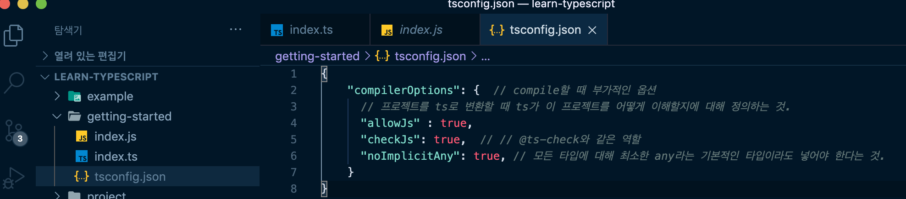
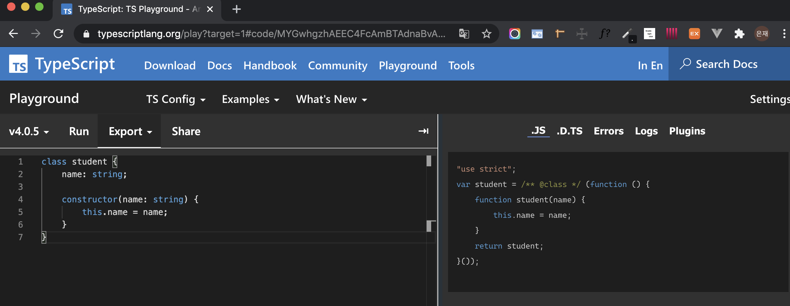

####  🚀 인프런_[타입스크립트 입문 - 기초부터 실전까지]
 

### 02. 타입스크립트 시작하기
#### 2-1) 타입스크립트 프로젝트 시작하는 방법(라이브러리 설치와 TSC)
-  브라우저가 ts파일을 인식하도록 js파일로 변환해야 한다. (compile)
	1)  `$ node -v` : node 버전이 설치되어있는지 확인.
	2)  `$ npm i typescript -g` :  node 기반으로 사용하는 javascript 라이브러리인 typescript를 설치.
	3) `$ tsc 파일명.ts` : 해당 ts파일을 js로 변환. 해당 ts파일과 같은 이름, 내용의 js파일이 생성된다.
***
-   [NPM 무료 강의](https://www.inflearn.com/course/%ED%94%84%EB%9F%B0%ED%8A%B8%EC%97%94%EB%93%9C-%EC%9B%B9%ED%8C%A9/lecture/37370?tab=curriculum)
-   [NPM 소개 문서](https://joshua1988.github.io/webpack-guide/build/node-npm.html#npm)
-   [npm i typescript -g 명령어 의미](https://joshua1988.github.io/webpack-guide/build/npm-module-install.html#npm-%EC%A0%84%EC%97%AD-%EC%84%A4%EC%B9%98)

 

#### 2-2) 타입스크립트 설정 파일
- 매번 ts파일을 js로 변환하기보다는 웹자동화 도구를 이용해 반복적인 명령어들을 자동화하는 것이 효율적.
	- 웹팩을 사용하면 좋다.
- tsc로 typescript파일을 컴파일할 때 부가적인 옵션을 줄 수 있다.
	- `tsconfig.json`
		- key value형태로 정의를 해주면 된다.
	
	
***
-   [웹팩 핸드북(문서)](https://joshua1988.github.io/webpack-guide/)
-   [프론트엔드 개발자를 위한 웹팩(온라인 강의)](https://www.inflearn.com/course/%ED%94%84%EB%9F%B0%ED%8A%B8%EC%97%94%EB%93%9C-%EC%9B%B9%ED%8C%A9)
-   [타입스크립트 설정 파일 옵션(문서)](https://www.typescriptlang.org/docs/handbook/compiler-options.html)

 

#### 2-3) 타입스크립트 플레이그라운드 사이트 소개
-   [플레이그라운드 사이트](https://www.typescriptlang.org/play/).  
	  
-   [바벨 사이트](https://babeljs.io/)
