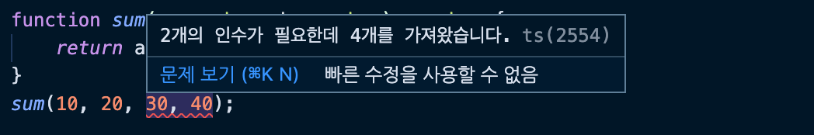

####  🚀 인프런_[타입스크립트 입문 - 기초부터 실전까지]
<br/>

### 3. 타입스크립트 기초 - 변수와 함수 타입 정의하기
#### 3-1) 기본 타입 - 문자열, 숫자, 배열
- 타입스크립트의 기본 타입에는 크게 12가지가 있다.
	-   Boolean
	-   Number
	-   String
	-   Object
	-   Array
	-   Tuple
	-   Enum
	-   Any
	-   Void
	-   Null
	-   Undefined
	-   Never
```javascript
// JS 문자열 선언 방식
var str = 'hello';

 
// TS 문자열 선언 방식 (TS를 사용할 떄는 대부분 es6이상을 이용한다. let, const 사용)
let str: string = 'hello';
 
// TS 숫자
let num: number = 10;

// TS 배열
let arr: Array<number> = [1, 2, 3]; // Array<타입>
let items: number[] = [1, 2, 3]; // 배열 리터럴 앞에 타입을 정의해줘도 된다.
let heroes: Array<string> = ['Capt', 'Thor', 'Hulk', 10]; // 변수 타입에 어긋나는 경우 경고를 띄워줌.(빨간밑줄-마우스오버하면 내용 뜸.)
```


***
-   [타입스크립트 변수 타입](https://joshua1988.github.io/ts/guide/basic-types.html)
-   [Let & Const 안내 문서](https://joshua1988.github.io/es6-online-book/const-let.html)
-   [개발 환경 구성 링크](https://github.com/joshua1988/learn-typescript#%EA%B0%9C%EB%B0%9C-%ED%99%98%EA%B2%BD)
<br/>

#### 3-2) 기본 타입 - 튜플, 객체, 진위값
- 간단한 객체는 object로 정의할 수 있지만, 더 구체적으로 object를 정의하고 싶다면 객체를 열어두고 그 안에 들어갈 속성의 타입까지 정의할 수 있다.
```javascript
// TS 튜플:
// 타입뿐만 아니라 위치까지 정해준다.(모든 인덱스의 타입을 정해줌)
let address: [string, number] = ['gangnam', 100];


// TS 객체
let obj: object = {};
// let person: object = {
// 		name: 'capt',
// 		age: 100
// };
// 구체적으로 객체의 타입까지 지정할 수 있다.
let person: { name: string, age: number } = {
	name: 'capt',
	age: 100
} 

// TS 진위값
let show: boolean = true;
```

<br/>

#### 3-3) 함수 타입 - 파라미터, 반환값
```javascript
// 함수의 파라미터에 타입을 정의하는 방식
function sum(a:number, b:number) {
	return a + b;
}
sum(10, 20);
  
// 함수의 반환 값에 타입을 정의하는 방식
function add(): number {
	return 10;
}

// 함수에 타입을 정의하는 가장 기본적인 방식
// 파라미터와 반환값의 타입을 정의하고, 파라미터의 갯수에 맞춰 인자의 갯수도 맞춰줘야하는 1:1 맵핑.
function sum(a: number, b: number):  number {
	return a + b;
}
```
***
-   [타입스크립트 핸드북 - 함수](https://joshua1988.github.io/ts/guide/functions.html)

<br/>

#### 3-4) 함수 타입 - 파라미터를 제한하는 특성
- JS에서는 함수실행 시 인자가 추가적으로 들어가게 되면 추가적인 인자들에는 반응하지 않는다. 이것이 JS가 주는 유연함이다.
```javascript
function sum(a, b) {
	return a + b;
}
sum(10, 20, 30, 40, 50);
```
- TS에서는 어떻게 제약이 되나.
	- 불필요한 인자가 들어갈 경우 타입스크립트의 함수가 함수에 대한 스펙을 정확이 이해한 상태이기 때문에 TS가 잡아준다.
```javascript
function sum(a: number, b: number): number {
	return a + b;
}
sum(10, 20, 30, 40);
```


<br/>

#### 3-5) 함수 타입 - 옵셔널 파라미터
```javascript
// 함수의 옵셔널 파라미터:
// 특정 파라미터를 선택적으로 사용하고 싶을 때 '?'를 붙여준다.
function log(a: string, b?: string, c?: string) {
}
log('hello world');
log('hello ts', 'abc');
```
- 타입스크립트에서는 물음표와 느낌표에 많은 차이가 있다.
	- 물음표는 옵셔널 체이닝(?)과 옵셔널 파라미터(?) 등으로 사용됩니다.
	- 느낌표는 non-null assertion 이라고 해서 강의 후반부에 나오는 타입 단언의 한 연산자로 사용됩니다. 특정 코드가 null이 아니다라는 것을 사용자가 타입스크립트에게 얘기해주는 거죠.
***
- [타입스크립트에서 느낌표 기호와 물음표 기호의 차이(강의 질문)](https://www.inflearn.com/questions/83684)
