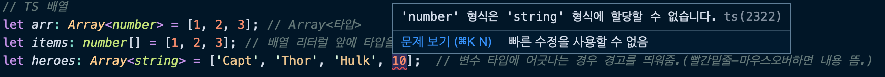

####  🚀 인프런_[타입스크립트 입문 - 기초부터 실전까지]
<br/>

### 3. 타입스크립트 기초 - 변수와 함수 타입 정의하기
#### 3-1) 기본 타입 - 문자열, 숫자, 배열
- 타입스크립트의 기본 타입에는 크게 12가지가 있다.
	-   Boolean
	-   Number
	-   String
	-   Object
	-   Array
	-   Tuple
	-   Enum
	-   Any
	-   Void
	-   Null
	-   Undefined
	-   Never
```javascript
// JS 문자열 선언 방식
var str = 'hello';

 
// TS 문자열 선언 방식 (TS를 사용할 떄는 대부분 es6이상을 이용한다. let, const 사용)
let str: string = 'hello';
 
// TS 숫자
let num: number = 10;

// TS 배열
let arr: Array<number> = [1, 2, 3]; // Array<타입>
let items: number[] = [1, 2, 3]; // 배열 리터럴 앞에 타입을 정의해줘도 된다.
let heroes: Array<string> = ['Capt', 'Thor', 'Hulk', 10]; // 변수 타입에 어긋나는 경우 경고를 띄워줌.(빨간밑줄-마우스오버하면 내용 뜸.)
```


***
-   [타입스크립트 변수 타입](https://joshua1988.github.io/ts/guide/basic-types.html)
-   [Let & Const 안내 문서](https://joshua1988.github.io/es6-online-book/const-let.html)
-   [개발 환경 구성 링크](https://github.com/joshua1988/learn-typescript#%EA%B0%9C%EB%B0%9C-%ED%99%98%EA%B2%BD)
