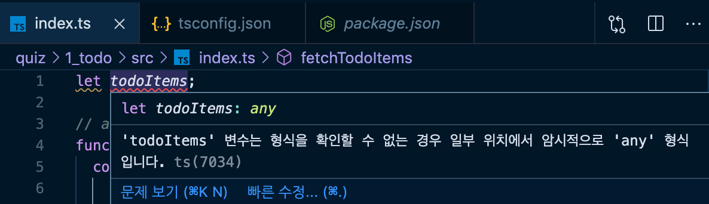
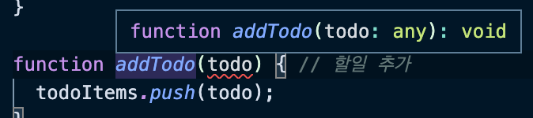
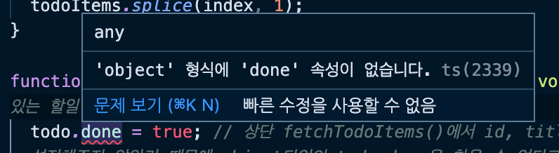

####  🚀 인프런_[타입스크립트 입문 - 기초부터 실전까지]
<br/>

### 4. 첫 번째 프로젝트 - 할 일 관리 애플리케이션
>프로젝트 실습 파일:
> `실습자료` - `learn-typescript` - `quiz` - `1_todo`

#### 4-1) 첫 번째 실습 프로젝트 소개, 환경 구성, 코드 분석
- 변수 타입정의와 함수의 타입정의만으로도 간단한 애플리케이션에 대한 타입을 입힐 수 있다.
1) `$ node -v`으로 node가 설치되어있는지 확인 후, `$ npm i`로 package.json에 잡아놓은 typescript와 babel 관련 내용을 설치해 준다.
2) `command(ctrl) + ,`로 설정페이지 접속 후,  `format on save`가 꺼져있는지 확인한다.(eslint로만 문법확인을 하기 위해서)

<br/>

#### 4-2) 프로젝트 구성 파일 소개(NPM, ESLint, TS)
- `tsconfig.json`파일에서 `"noImplicitAny"`를 `true`로 바꿔준 후, `index.ts`파일을 확인하면 빨간 밑줄이 그어진 오류들을 확인할 수 있다. [`[참고]타입스크립트 설정 파일`](https://velog.io/@design0728/%ED%83%80%EC%9E%85%EC%8A%A4%ED%81%AC%EB%A6%BD%ED%8A%B8-%EC%8B%9C%EC%9E%91%ED%95%98%EA%B8%B0#%E1%84%90%E1%85%A1%E1%84%8B%E1%85%B5%E1%86%B8%E1%84%89%E1%85%B3%E1%84%8F%E1%85%B3%E1%84%85%E1%85%B5%E1%86%B8%E1%84%90%E1%85%B3-%E1%84%89%E1%85%A5%E1%86%AF%E1%84%8C%E1%85%A5%E1%86%BC-%E1%84%91%E1%85%A1%E1%84%8B%E1%85%B5%E1%86%AF)
	- 타입스크립트에서 자바스크립트로 변환할 때 제거하지 않으면, 즉 에러가 남아있으면 컴파일(변환)이 되지 않는다.
- `package.json`이라는 것은 `$ npm init -y`명령어로 프로젝트를 초기화하고, 
	-  `npm`의 기본 설정 파일 중에서 `"devDependencies"`의 `babel`과 `typescript-eslint`와 `prettier` 등이 들어있는 것을 볼 수 있다.
	- eslint가 타입스크립트 문법을 보조하고 있다고 볼 수 있는 것이다. 
		- `.eslintrc.js`에 설정된 룰들을 인식 후, 룰에 맞지 않는 것들을 에러로 표시해 준다. 
- 
***
-   [NPM 소개 문서](https://joshua1988.github.io/webpack-guide/build/node-npm.html#npm)
<br/>

#### 4-3) 실습 방법 안내 및 any, void 소개
- `any` 
	- `string`, `number`, `array` 등 수많은 타입을 통칭한다.
	- 자바스크립의 원래 성질인 실행하는 시점의 타입을 구분해서 할당해주는 역할로 존재하는 것이다.
	- 자바스크립트 프로젝트에 타입을 적용해서 변환하려면 전체적으로 `any`로 타입을 설정 후 하나씩 구체적으로 바꿔가는 것이 정석적인 방법이다.
  
	  
  
	- 속성을 모르겠다면 `any`라고 붙여주자.
	 ```typescript
	let todoItems: any;
	```
- 함수의 반환 타입

	
  
	- `:void`는 함수의 반환 값이 존재하지 않음을 명시적으로 나타낸 것이다.
<br/>


#### 4-4) 실습 풀이 1 - 변수, 함수 타입
- 타입을 구체적으로 강하게 정의하자!
	- 변수에 대한 구체적인 타입을 정의할 수록 에러를 줄일 수 있다.
	- 타입스크립트가 주는 장점들을 극대화할 수 있다.
```typescript
let  todoItems:  object[]; // 맨 아래 todoItems = fetchTodoItems();를 보면 todoItems가 배열이라는 것을 알 수 있다.
// 배열 속 요소가 객체이기 때문에 Object로 적어준 것.

// api
function  fetchTodoItems():  object[] {
	const  todos  =  [
		{ id:  1, title:  '안녕', done:  false  },
		{ id:  2, title:  '타입', done:  false  },
		{ id:  3, title:  '스크립트', done:  false  },
	];
	return todos;
} 

// crud methods
function  fetchTodos():  object[] { // api 호출 후 변수 todos에 담아서 변환
	const  todos  =  fetchTodoItems();
	return todos;
}

function  addTodo(todo:  object):  void { // 할일 추가
	todoItems.push(todo);
}

function  deleteTodo(index:  number):  void { // 특정 위치에 있는 할일 제거 처리
	todoItems.splice(index,  1);
}

function  completeTodo(index:  number, todo:  object):  void { // 특정 위치에 있는 할일 완료 처리
	todo.done  =  true; 
	// 상단 fetchTodoItems()에서 id, title, done의 타입을 설정해주지 않았기 때문에 object타입의 todo.done을 찾을 수 없다고 빨간 밑줄의 에러가 나타나는 것.
	// (해당 함수인 completeTodo()에서 todo를 object로 정의했기 때문에 object타입의 todo.done을 찾는 것이라고 보면 된다.)
	
	todoItems.splice(index,  1, todo);
}

// // business logic
// function  logFirstTodo() { // 할일 목록에서 첫 번째 출력
// 	return todoItems[0];
// }

// function  showCompleted() { // 할일 목록에서 완료된 목록만 보여줌
// 	return todoItems.filter(item  => item.done);
//}

// // TODO: 아래 함수의 내용을 채워보세요. 아래 함수는 `addTodo()` 함수를 이용하여 2개의 새 할 일을 추가하는 함수입니다.
// function  addTwoTodoItems() {
// // addTodo() 함수를 두 번 호출하여 todoItems에 새 할 일이 2개 추가되어야 합니다.
// }

// // NOTE: 유틸 함수
// function  log() {
// 	console.log(todoItems);
// }

todoItems =  fetchTodoItems();
// addTwoTodoItems();
// log();
```
<br/>


#### 4-5) 실습 풀이 2 - filter API & 화살표 함수 소개
-   [Array filter API - MDN](https://developer.mozilla.org/ko/docs/Web/JavaScript/Reference/Global_Objects/Array/filter)
```typescript
// business logic
function  logFirstTodo():  object { // 할일 목록에서 첫 번째 출력
	return todoItems[0];
	// 반환 값이 todoItems배열의 객체이니까 object라고 타입 설정.
}

function  showCompleted():  object[] { // 할일 목록에서 완료된 목록만 보여줌
	return todoItems.filter(item  => item.done);
	// filter로 조건에 맞는 객체로만 이루어진 배열을 다시 생성한 것이기 때문에 object[]라는 타입을 준 것.
}

// NOTE: 유틸 함수
function  log():  void {
	console.log(todoItems);
}
```

<br/>


#### 4-6) 실습 풀이 3 - 함수 구현
```typescript
// TODO: 아래 함수의 내용을 채워보세요. 아래 함수는 `addTodo()` 함수를 이용하여 2개의 새 할 일을 추가하는 함수입니다.
function  addTwoTodoItems():  void {
// addTodo() 함수를 두 번 호출하여 todoItems에 새 할 일이 2개 추가되어야 합니다.
	const  item1  =  {
		id:  4,
		title:  '아이템 4',
		done:  false
	}
	addTodo(item1);
	addTodo({
		id: 5,
		title: '아이템 5',
		done: false
	});
}
```

<br/>


#### 4-7) 실습 풀이 4 - 오류 해결 및 구체적인 타입 정의
- 이미지 속 오류를 해결해 보자.



```typescript
let  todoItems:  {  id:  number;  title:  string;  done:  boolean  }[];

// api
function  fetchTodoItems(): { id:  number; title:  string; done:  boolean }[]{
	const  todos  =  [
		{ id:  1, title:  '안녕', done:  false  },
		{ id:  2, title:  '타입', done:  false  },
		{ id:  3, title:  '스크립트', done:  false  },
	];
	return todos;
}

function  addTodo(todo: { id:  number; title:  string; done:  boolean }):  void { // 할일 추가
	todoItems.push(todo);
}

function  completeTodo(index:  number, todo: { id:  number; title:  string; done:  boolean }):  void { // 특정 위치에 있는 할일 완료 처리
todo.done  =  true; // 상단 
	todoItems.splice(index,  1, todo);
}

}
```
<br/>


#### 4-8)  실습 풀이 5 - 중복된 코드 제거 및 인터페이스 소개
- 중복되는 값인 `{  id:  number;  title:  string;  done:  boolean  }`(할일 아이템)의 구체적인 스펙(타입)을 정의해주는 방법이 있다.
```typescript
type Todo = {
	id:  number;
	title:  string;
	done:  boolean;
}

let  todoItems: Todo[];
```
- `interface`를 이용하는 것이 더 좋다.
	- 간결하게 코드를 정리할 수 있다.
```typescript
interface Todo {
	id:  number;
	title:  string;
	done:  boolean;
}

let  todoItems: Todo[];
```

***

👍🏼 위의 과정을 거친 완성 코드는 [여기](https://velog.io/@design0728/%EC%B2%AB-%EB%B2%88%EC%A7%B8-%ED%94%84%EB%A1%9C%EC%A0%9D%ED%8A%B8-%ED%95%A0-%EC%9D%BC-%EA%B4%80%EB%A6%AC-%EC%95%A0%ED%94%8C%EB%A6%AC%EC%BC%80%EC%9D%B4%EC%85%98#%EF%B8%8F-%EC%BD%94%EB%93%9C-%EC%99%84%EC%84%B1%EB%B3%B8)를 참고하자!
