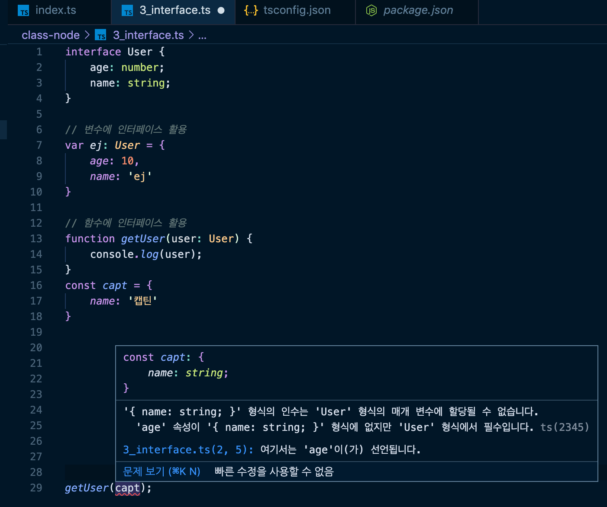

####  🚀 인프런_[타입스크립트 입문 - 기초부터 실전까지]
<br/>

### 5. 인터페이스
#### 5-1)   인터페이스 소개 및 변수를 정의하는 인터페이스
- 인터페이스로 정의한 것은 이후에 해당 인터페이스를 사용할 때 오탈자 방지, 중복/반복 되는 타입들을 손쉽게 정의할 수 있다는 장점이 있다.
```typescript
// 인터페이스로 정의
interface User {
	age: number;
	name: string;
}

// 변수에 인터페이스 활용
var ej: User = { // 변수에 활용한 인터페이스
	age: 10,
	name: 'ej'
}
// 정의된 인터페이스 사용시 반드시 정의한 타입으로 설정해줘야 한다. 
```

<br/>

#### 5-2) 함수의 인자를 정의하는 인터페이스


- 위 이미지에서 발생하는 오류를 해결하려면 정의된 인터페이스 타입을 모두 적어줘야한다.
```typescript
const  capt  =  {
	name:  '캡틴',
	age:  100
}
```

<br/>

#### 5-3) 함수 구조를 정의하는 인터페이스
- 타입스크립트가 가장 빛을 보는 구간은 API를 호출 해와서 API의 스펙(구조), 모양이 어떻다라는 것을 정의 후 활용하는 구간이다.
- 따라서 함수의 인자에 인터페이스를 어떻게 활용하는지 알고 있는 것이 중요하다.
- 함수의 전체적인 모습까지 인터페이스로 정의할 수 있다는 것이 인터페이스 장점이다.
```typescript
// 함수의 스펙(구조)에 인터페이스를 활용
interface SumFunction {
	(a: number, b: number): number;
}

var sum: SumFunction;
sum = function(a: number, b: number):  number {
	return a + b;
}
```

<br/>

#### 5-4) 인덱싱 방식을 정의하는 인터페이스
- 속성 이름이 정의되어있지 않고, 사용할 때마다 속성을 임의로 부여해서 사용할 수 있다.
- 배열의 인덱싱 방식에 대해서 인터페이스를 정의할 수 있다.
```typescript
// 인덱싱 :
interface StringArray{
	[index: number]: string;
}

var arr: StringArray = ['a', 'b', 'c'];
arr[0] = 10; // 에러 발생
arr[0]; // 'a' ([index: number]: string;)
```
- 위의 코드에서 `arr[0]`에 마우스오버하면 `'number' 형식은 'string' 형식에 할당할 수 없습니다.`라는 에러를 알려준다.


<br/>

#### 5-5) 인터페이스 딕셔너리 패턴
- 객체의 index, key에 접근할 때 정의해 놓은 인터페이스에 어긋날 경우 발생하는 오류를 알려준다.
- object를 가지고 간단하게 배열을 만들어 함수에 사용할 경우, 해당 object를 가지고 조작할 때마다 타입스크립트가 자동적으로 추론을 해서 타입까지 정의해준다는 장점이 있다.
```typescript
// 딕셔너리 패턴
interface StringRegexDictionary {
	[key: string]: RegExp
}

var obj: StringRegexDictionary = {
	// sth: /abc/,
	cssFile: /\.css$/,  // css 확장자를 가진 모든 파일을 가져온다는 정규식.
	jsFile: /\.js$/,  // js 확장자를 가진 모든 파일을 가져온다는 정규식.
}
```

<br/>

#### 5-6) 인터페이스 확장(상속)
- OOP(객체지향 프로그래밍)에서의 상속, 자바스크립트의 프로토타입과 같이 인터페이스를 상속받아서 기존에 있던 것보다 더 확장해서 사용하는 것이다.
```typescript
// 인터페이스 확장
interface Person {
	name: string;
	age: number;
}

// 	// Person인터페이스와 중복되는 부분이 존재.
// interface Developter {
// 	name: string;
// 	age: number;
// 	language: string;
// }

interface Developter extends Person {
	// 다른 인터페이스와 중복되는 값들을 상속받아 사용할 수 있다.
	language: string;
}
```
- 위에서 `Developter`인터페이스를 이용해 변수를 선언할 경우, `language`, `age`, `name`모두 정의 해줘야 한다.
```typescript
var  captain: Developter = {
	language: 'ts',
	age: 100,
	name: '캡틴'
}
```


***
- ['딕셔너리 인터페이스' 참고](https://hoony-gunputer.tistory.com/entry/5-typescript-interfaces)

