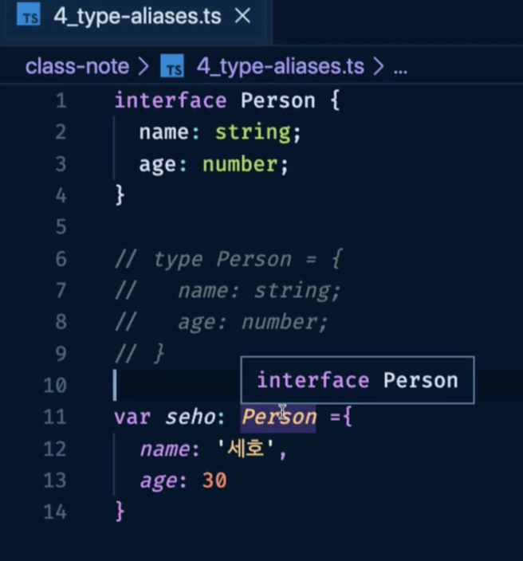
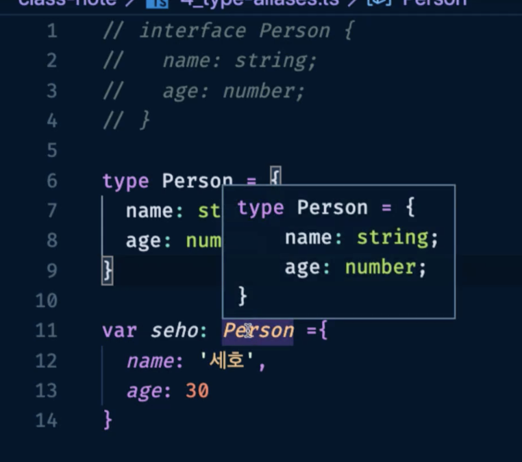

####  🚀 인프런_[타입스크립트 입문 - 기초부터 실전까지]
<br/>

### 6. 타입 별칭
#### 6-1) 타입 별칭 소개
- 타입 별칭
	- 특정 타입이나 인터페이스를 참조할 수 있는 타입 변수를 의미한다.
		```typescript
		// string 타입을 사용할 때
		const name: string = 'capt';

		// 타입 별칭을 사용할 때
		type MyName = string;
		const name: MyName = 'capt';
		```
	- 복잡한 구조도 타입 별칭을 이용해 정의할 수 있다.
		```typescript
		type Developer = {
		  name: string;
		  skill: string;
		}
		```
***
- [타입스크립트 핸드북 - 타입 별칭](https://joshua1988.github.io/ts/guide/type-alias.html)

<br/>

#### 6-2) 타입 별칭 코드 예제
- 인터페이스와 타입으로 정의를 선언 후, 변수 선언에 사용했을 때 어떻게 다르게 나타나는지 확인해보자.
	- `Person`이라는 인터페이스를 사용했다고 알려준다.
	
	
	


	- `Person`이라는 타입의 모습을 바로 볼 수 있다.
	
	


- 타입을 사용할 수 있는 모든 곳에 별칭을 붙일 수 있다.
- 타입 별칭을 사용하면 중복되는 타입을 쉽게 정의할 수 있고 코드 가독성이 높아진다.
	```typescript
	type Todo = { id: string, title: string, done: boolean }
	function getTodo(todo: Todo) {}
	```

<br/>

#### 6-3) 타입 별칭과 인터페이스의 차이점
- 타입 별칭은 새로운 타입 값을 생성하는 것이 아니라 정의된 타입에 대해 쉽게 참고할 수 있도록 이름을 부여하는 것이다.
- 타입 별칭과 인터페이스의 가장 큰 차이점은 확장 가능/불가능 여부이다. 
	- 인터페이스는 확장이 가능하지만 타입은 확장이 되지 않는다. 
	- 따라서, 가급적 확장 가능한 인터페이스로 선언하면 좋다.
***
-   [좋은 소프트웨어는 확장이 용이해야 한다는 원칙의 위키 피디아 글](https://en.wikipedia.org/wiki/Open%E2%80%93closed_principle)
