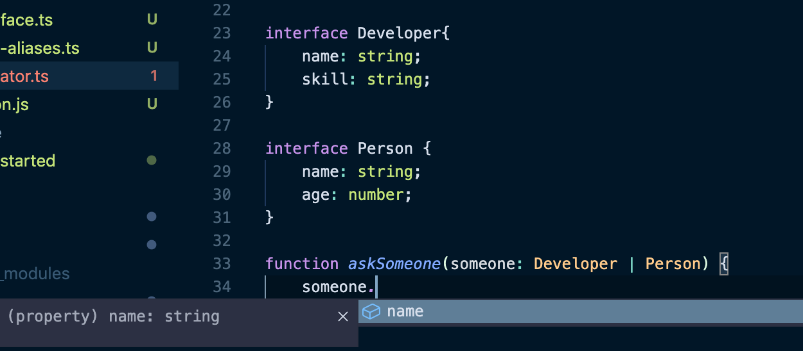

####  🚀 인프런_[타입스크립트 입문 - 기초부터 실전까지]
<br/>

### 7. 연산자를 이용한 타입 정의
#### 7-1) 연산자를 이용한 타입 정의 - Union Type
- Union type
	- 특정 변수/파라미터에 하나 이상의 타입을 사용할 수 있게 해준다.
	```typescript
	// Union Type: 하나 이상의 타입을 사용할 수 있도록 해준다.
	var ej: string | number | boolean;
	
	function logMessage(value: string | number) {
		console.log(value);
	}
	logMessage('hello');
	logMessage(100);
	```
<br/>

#### 7-2)   유니온 타입의 장점
- 타입 가드
	- 특정 타입으로 타입의 범위를 좁혀나가는 필터링하는 과정.
	```typescript
	function logMessage(value: string | number) {
		if(typeof value === 'number') {
			value.toLocaleString();
		}
		if(typeof value === 'string') {
			value.toString();
		}
		// 위에 적힌 타입이 아닌 경우의 error를 발생시켜 볼 수 있다.
		throw new TypeError('value must be string or number'); 
	}
	```
<br/>

#### 7-3)   유니온 타입의 특징
- 2개의 구조체가 유니온 타입이 될 경우.

	

	> 유니온 타입을 이용해 `Developer`과 `Person`을 타입으로 사용했지만, `someone`이라는 파라미터는 접근할 수 있는 속성이 `name`뿐이라고 나온다.
	>> 타입스크립트 관점에서는 `someone`에 어떤 값이 들어올지 알 수 없기 때문에, `Developer`과 `Person` 각각에만 있는 속성은 타입세이프하지 않는다고 인식한다.
	> 즉, 코드상으로 에러가 발생할 수 있다고 보기 때문에 공통된(보장된) 속성에 대한 것만 제공하는 것이다.

<br/>

#### 7-4)   인터섹션 타입 소개
```typescript
// & : 인터섹션 타입
var capt: string & number & boolean;
```
- 예를 들면 `string`, `number`, `boolean`을 모두 만족하는 타입을 `인터섹션 타입`이라고 한다.


- `유니온 타입`과 `인터섹션 타입`의 차이를 볼 수 있다.
- `인터섹션 타입`의 경우 공통되지 않은 속성도 사용이 가능하다.

<br/>

#### 7-5)   유니온 타입과 인터섹션 타입의 차이점
- `유니온 타입`은 함수 실행 시 각 타입별로 따로 실행시켜야 한다.
	- 타입 추론을 해야하지만 넘기는 타입에 대해 선택지가 생기는 것이다.
```typescript
// 유니온 타입
function askSomeone(someone: Developer | Person) {
	someone.name;
	someone.skill // skill 속성이 없다는 에러를 알려주는 빨간 밑줄 생김.
	someone.age // age 속성이 없다는 에러를 알려주는 빨간 밑줄 생김.
}
askSomeone({ name: '디벨로퍼', skill: '웹 개발' });
askSomeone({ name: '캡틴', age: 100 });
 ```
 
 - `인터섹션 타입`은 사용한 타입을 모두 만족해야 한다. 
	 - 모든 타입을 포함하는 새로운 타입을 만들게 되는 것이다.
```typescript
// 인터섹션 타입

// Developer와 Person을 모두 합친 하나의 타입이 된다.
// 따라서 name, skill, age 모두 보장이 된다.
function askSomeone(someone: Developer & Person) {
	someone.name;
	someone.skill
	someone.age
}
askSomeone({ name: '디벨로퍼', skill: '웹 개발', age: 100 });
```
