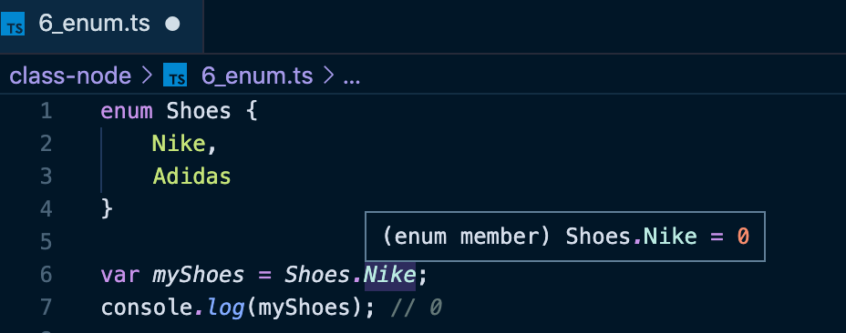
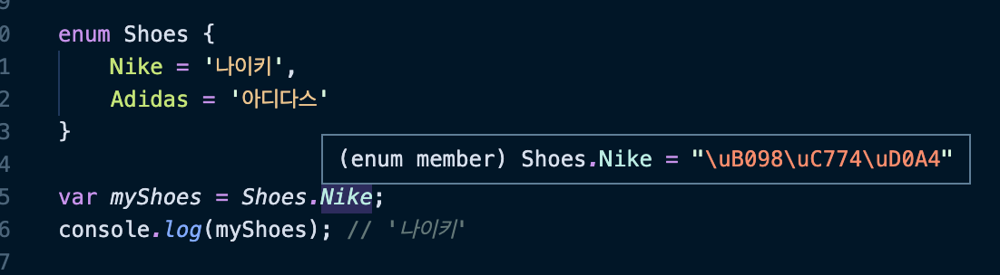

####  🚀 인프런_[타입스크립트 입문 - 기초부터 실전까지]
<br/>

### 8. 이넘
#### 8-1) 이넘 소개
- 이넘(Enums)
	- 특정 값들의 집합을 의미하는 자료형이다.
	- 실제 서비스 개발 시 드롭다운이나 정해져 있는 목록의값들을 지정할 때 사용하기 좋다.
***
- [타입스크립트 핸드북 - 이넘](https://joshua1988.github.io/ts/guide/enums.html)

<br/>

#### 8-2) 숫자형 이넘
- 별도의 값을 지정하지 않을 경우 `숫자형 이넘`으로 취급된다.

	
	
	- `Shoes`의 값을 지정하지 않았기 때문에, `Shoes.Nike`값이 `0`이므로 `myShoes`의 값도 `0`으로 출력된 것이다.
	- 이넘의값이 추가 될 수록 숫자가 1씩 증가된다. 따라서, `Shoes`의 `Adidas`는 값이 1이 된다. 

<br/>

#### 8-3) 문자형 이넘


> 숫자형 이넘 vs 문자형 이넘
>- `숫자형 이넘`은 초기 값을 주지 않으면 0부터 차례로 1씩 증가한다. `문자형 이넘`은 자동적으로 값이 부여되지 않는다.
>- `숫자형 이넘`의 값은 가끔 불명확하게 나올 때가 있지만, `문자형 이넘`은 항상 명확한 값이 나와 읽기 편하다.

<br/>

#### 8-4) 이넘 활용 사례
- 아래 코드는 오직 `yes`라는 문자만 `정답입니다`라는 출력을 가능하게 한다.
```typescript
	// 예제
	function askQuestion(answer: string) {
		if(answer === 'yes') {
			console.log('정답입니다.');
		}
		if(answer === 'no') {
			console.log('오답입니다.');
		}
	}
	askQuestion('yes'); // 가능
	askQuestion('예스'); // 불가능
	askQuestion('y'); // 불가능
```
<br/>

- 다양한 `yes`의 형태를 이용하고 싶을 때는 이것들을 구체적인 값으로 제한해야 한다.
	- 인자값을 문자열로 넘겨줄 때 정해진 값이 아닌 다양한 형태의 값을 넘겨줘야 하는데, 이때 구체적인 값으로 제한하는 것이 이넘이다.
```typescript
// 이넘 사용할 경우
enum Answer {
	Yes  =  'yes',
	No  =  'no',
}
function  askQuestion(answer:  Answer) {
	if(answer = Answer.Yes) {
		console.log('정답입니다.');
	} 
	if(answer = Answer.No) {
		console.log('오답입니다.');
	}
}
askQuestion(Answer.Yes);
askQuestion('yes'); // 일반 문자열로 인자값을 줄 경우 에러가 발생한다.
```
- 이넘을 사용했기 때문에 이넘에서 제공하는 데이터만 인자로 넣을 수 있게 된다.
	- 파라미터의 타입으로 정의 된 이넘에서 제공되는 값만 넘길 수 있는 것이다.

***
👍🏼 드롭다운 등의 목록이 필요한 형태에서는 이넘을 정의해서 사용하는 것이 예외처리 케이스를 감소시키고 정확한 코드를 작성할 수 있게 해준다.
