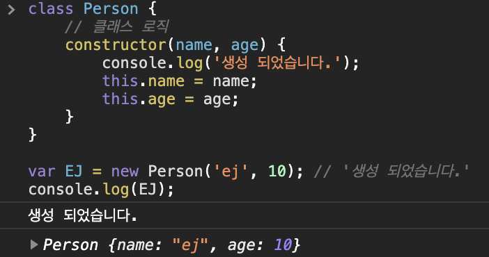

####  🚀 인프런_[타입스크립트 입문 - 기초부터 실전까지]
<br/>

### 9. 클래스 
#### 9-1) 클래스 소개
- ES2015(ES6)에서 소개된 문법.
- 클래스가 하는 역할은 기본적으로 인스턴스를 만들어 주는 것이다.



<br/>

#### 9-2) 자바스크립트 프로토타입 소개
- 자바스크립트가 프로토타입 기반 언어라는 개념을 인식해야 클래스 사용시 이점을 이해하기 쉽다.
- 많은 객체들을 활용할 때 중복되는 코드들에 대해 줄일 수 있는 방법이 필요한데, 이 방법이 자바스크립트에서 지향하는 프로토타입을 이용한 상속이라는 개념이다.
```javascript
var user = { name: 'capt', age: 100 };
var admin = {};

admin._proto_ = user;

console.log(admin.name) // 'capt'
console.log(admin.age) // 100
```
	- `admin`에 기본적인 정보가 없는 상태에서 `admin`의 프로토타입을 `user`라고 하는 객체로 정의했을 때, `user`가 가지고 있던 정보들을 전부 상속받아 사용할 수 있게 되는 것이다.
```typescript
admin.role = 'admin';
```
	- `admin`에 `role`이라는 새로운 속성을 정의 후 `admin`을 살펴보면, `role: "admin"`과 `_proto_: Object`가 나타난다. 
	- `_proto_`를 열어보면 앞서 정의되었었던 `age: 100, name: 'capt'`를 볼 수 있다.

> 상속받은 정보들은 프로토타입으로 거슬러 올라가 사용할 수 있다.
***
-   [MDN 자바스크립트 프로토타입과 상속](https://developer.mozilla.org/en-US/docs/Web/JavaScript/Inheritance_and_the_prototype_chain)

<br/>

#### 9-3) 자바스크립트 프로토타입의 활용 사례
```javascript
var obj = { a: 10 };
obj.keys(obj); // ["a"]
obj.hasOwnProperty('a'); // true
```
- Built-in Javascript API ( Javascript Native API)
	- array, object 등에서 제공하고 있는 모든 메소드들을 의미한다. 
***
-   [MDN Object 문서](https://developer.mozilla.org/ko/docs/Web/JavaScript/Reference/Global_Objects/Object)

<br/>

#### 9-4) 프로토타입과 클래스와의 관계
- class라고 하는 것은 기존에 있었던 문법에 신테틱 슈거라고 하는 보기좋은 코드라고 보면 된다. 추가적으로 주는 기능이나 기존에 제공하던 성질을 바꾸지 않고 단순히 문법만 바뀐 것이다. 
```javascript
// 생성자 함수
function Person(name, age) {
	this.name = name;
	this.age = age;
}
var capt = new Person('ej', 10)
```
```javascript
class Person {
	// 클래스 로직
	constructor(name, age) {
		console.log('생성 되었습니다.');
		this.name = name;
		this.age = age;
	}
}
var EJ = new Person('ej', 10); // '생성 되었습니다.'
```
	- 위의 두 코드는 완전히 같은 것이다.
	- 클래스를 바벨 등으로 돌려 보면 생성자함수를 사용한 것을 알 수 있다. 
- 객체지향 언어에 익숙한 개발자들이 자바스크립트를 수월하게 사용하기 위해 클래스 기반의 문법을 제공한 것이 배경이 된다.
<br/>

#### 9-5) 타입스크립트의 클래스 문법
- 기존 자바스크립트의 클래스와 문법적 차이를 살펴보자.
```typescript
class Person {
	// ts에서는 class에서 사용할 속성들을 최상단에 정의해줘야 한다.
	// 변수에 대한 유효범위도 설정할 수 있다.
	private name: string; // 해당 클래스 안에서만 사용.
	public age: number; // 기본적으로 public라고 설정된다.
	readonly log: string; // 읽기만 가능.(변경 불가능)

	constructor(name: string, age: number) {
	this.name = name;
	this.age = age;
	}
}
```
- 리액트도 기존 클래스 기반으로 사용하던 문법에서 리액트 훅 기반의 함수형 코드를 사용하는 문법으로 변하고 있다.
```typescript
// 리액트 예전 문법 - 클래스 기반 코드
class App extends React.Component {
}

// 리액트 최신 문법 - 훅 기반의 함수형 코드
function App() {
	return <div>Hello World</div>
}
```
- Vue.js
	- Vue컴포지션 API라는 것이 최근데 추가가 될 것이다.
		- `setup() {}`이라는 API를 이용해 추가적인 옵션들을 사용할 수 있다.
	```typescript
	new Vue({
		el: '',
		setup() {
		}
	})
	```
