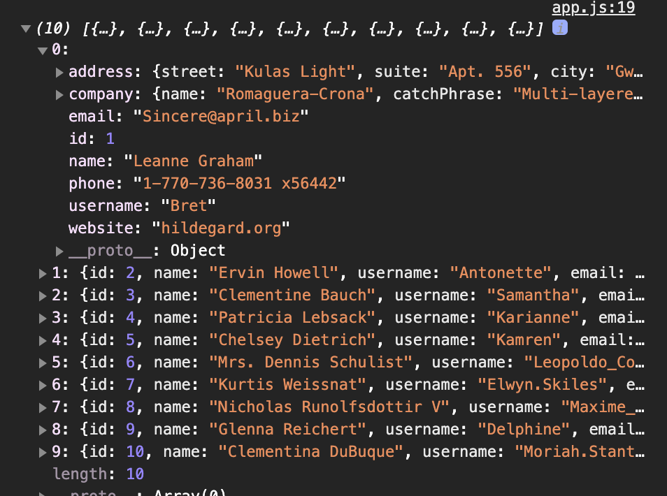

##  입문 - 기초부터 실전까지


## 1. 타입스크립트 소개와 배경
### 1-1) 타입스크립트란?
- 타입이 입혀진 자바스크립트
- 자바스크립트의 확장된 언어
- 자바스크립트와 달리 브라우저에서 실행하기 위해 파일을 한 번 변환해줘야 한다.(=컴파일(compile))
***
-   [타입스크립트 공식 문서](https://www.typescriptlang.org/)
-   [구글 번역기 링크](https://www.google.com/search?q=google+translate&oq=google+translate&aqs=chrome.0.69i59j0l7.1732j0j1&sourceid=chrome&ie=UTF-8)
<br/>

### 1-2) 왜 타입스크립트를 쓰면 좋은가요?
-   1️⃣ [에러의 사전 방지](https://joshua1988.github.io/ts/why-ts.html#%EC%97%90%EB%9F%AC%EC%9D%98-%EC%82%AC%EC%A0%84-%EB%B0%A9%EC%A7%80)
	- 받아온 데이터의 형상들을 알지 못할 경우 낼 수 있는 에러, 오탈자로 인한 에러들을 방지할 수 있다.
	- data가 아래의 address처럼 객체 속의 객체로 존재할 경우, typescript를 사용하면 보다 명확하게 데이터를 화면에 불러낼 수 있다.
		
		```javascript
		address.innerText  =  user[0].address;
		``` 
		- 이렇게 불러 낼 경우 화면에는 `[object Object]`라고 나타난다.  
		

***
-   [HTTP 요청 라이브러리 axios](https://github.com/axios/axios)
-   [Promise 소개 글](https://joshua1988.github.io/web-development/javascript/promise-for-beginners/)
-   [JSONPlaceHolder 사이트](https://jsonplaceholder.typicode.com/)

<br/>

### 1-3) 자바스크립트에 타입이 있을 때의 첫 번째 장점
- 1️⃣ 에러의 사전 방지
	- Jsdoc 기본 문법을 사용해 데이터의 속성을 지정해주면 브라우저로 가지 않고 코드상에서 데이터를 확인할 수 있다.
		```
		/**
		*
		/
		 ```

		```typescript
		// VSCode상에서 해당 코드에 마우스오버시 fetch내용을 볼 수 있게 하려면 아래처럼 작성하면 된다. - Jsdoc의 기본 문법.
		/**
		* @typedef  {object}  Address
		* @property  {string}  street
		* @property  {string}  city
		*/
		/**
		* @typedef  {object}  User
		* @property  {string}  name
		* @property  {string}  email
		* @property  {Address}  address
		*/
		/** // 제네릭..?
		* @returns  {promise<User>}
		*/
		function  fetchUser() {
			return  axios.get(url);
		}

		fetchUser().then(function(response) {
			response.address.city;
		})
		```
***
-   [Jsdoc 문서 안내](https://devdocs.io/jsdoc/)
<br/>

### 1-4) 자바스크립트에 타입이 있을 때의 두 번째 장점
- 1️⃣에러의 사전 방지
1.
	```javascript
		function  sum(a, b) {
			return  a  +  b;
		}
		sum(10, 20); // 30
		sum(10, '20'); // 1020
	```
	- `sum()`함수 실행 시 인자로 숫자가 아닌 것을 넣으면 원하는 답인 `30`이 나오지 않는다.
	
	- 현재 인자인 `a, b`는 속성이 `any`로 어떤 속성이어도 인자값이 될 수 있는 상태이다.
	<br/>
	
2.
	```javascript
		function  sum(a:  number, b:  number):  number {
			return a + b;
		}
		sum(10, '20');
	```
	- `sum`함수의 인자 `a, b`모두 `number`이고, 그 숫자 두개를 받아서 반환해주는 것까지 `number`라고 타입스크립트에서 자동적으로 추론해준다.
		
	- `a, b`에 `number`가 아닌 다른 속성의 인자를 넣을 경우 사용할 수 없다는 표시를 해준다.
		
-  2️⃣ [코드 가이드 및 자동 완성(개발 생산성 향상)](https://joshua1988.github.io/ts/why-ts.html#%EC%BD%94%EB%93%9C-%EC%9E%90%EB%8F%99-%EC%99%84%EC%84%B1%EA%B3%BC-%EA%B0%80%EC%9D%B4%EB%93%9C)
	- `sum`함수실행문을 `result`라고 선언 후, 아래에 `result`를 입력하면 자동으로 그 값이 	`number`라고 안내창이 뜬다. 
		
		- `number`에서 제공하는 모든 api를 사용할 수 있는 것.
	```typescript
		var  result  =  sum(10,  20); /
		result.toLocaleString(); 
		// toLocaleString(): 현재 설정 된 언어를 기반으로 숫자를 문자열로 변환해주는 api.
	```
	-  Intellisense: VSCode에서 자동완성시켜주는 기능.
***
-   [Intellisense 문서](https://code.visualstudio.com/docs/editor/intellisense)
<br/>

### 1-5) 자바스크립트를 타입스크립트처럼 코딩하는 방법
- JS파일에서 Jsdoc를 이용해서 파라미터를 정의해주면, 해당 함수에 마우스오버시 프리뷰가 나오는 것을 볼 수 있다.
	```javascript
		/**
		*
		* @param  {number}  a 첫 번째 숫자
		* @param  {number}  b 두 번째 숫자
		*/
		function  sum(a, b) {
			return  a  +  b;
		}
	```
	
- 하지만 Typescript파일이 아니기 때문에 잘못된 부분을 알려주지는 않는다.
	```javascript
	sum(10, '20');
	```
	- `number`가 아닌 파라미터가 들어와도, 알려주는 텍스트가 나타나지 않는다.
	- 상단에 `// @ts-check`라고 적어주면 Typescript를 사용한 것과 같은 효과 발생.
	```javascript
	// @ts-check
	/**
	*
	* @param  {number}  a 첫 번째 숫자
	* @param  {number}  b 두 번째 숫자
	*/
	function  sum(a, b) {
		return  a  +  b;
	}
	sum(10, '20');
	```
	
	
	- `sum()`함수에 파라미터로 `number`가 아닌 인자가 들어가면 알려준다.

	
